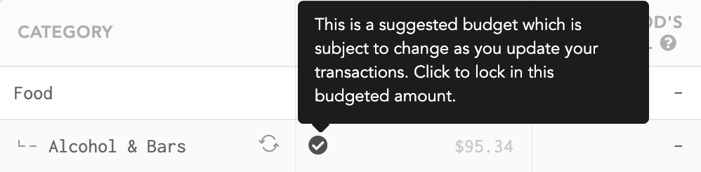
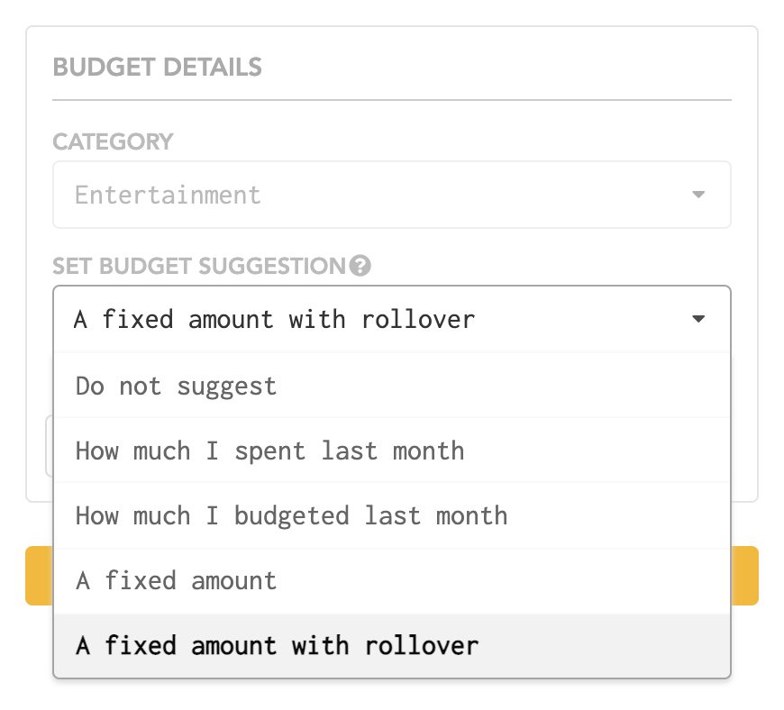

# Budget

## Suggested and rollover budgets

Let Lunch Money help you figure out what your budget should be each month! Introducing **suggested budgets**!

Your suggested budget can be based on any of the following:

* How much you spent last month
* How much you budgeted last month
* A fixed amount
* A fixed amount with rollover

**A fixed amount with rollover** means that every month, you want to budget the same amount while also taking into account how much you spent last month against your budget. For example, if you budget $100 every month for Coffee Shops and last month you only spent $80, then the suggested budget for this month will be $120 \($100 fixed amount plus $20 rollover\)

You must approve the budget suggestion to lock it in. **Before a budget suggestion is locked in, it is not considered in effect and is still subject to change** if you continue to update past transactions.

