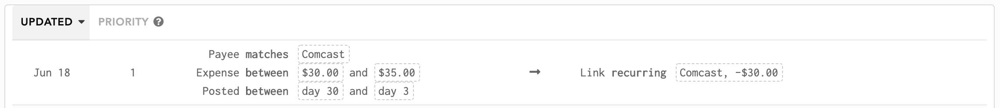
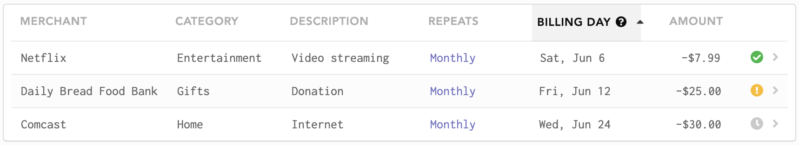
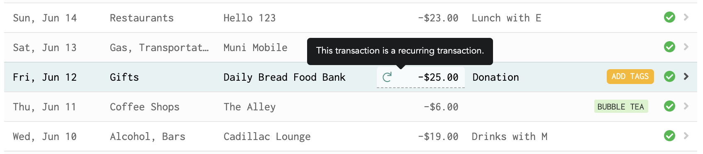

# Recurring Expenses

## What are recurring expenses?

Recurring expenses are transactions that repeat regularly. Examples include a monthly Netflix subscription, a quarterly insurance payment or a yearly gym membership. Each payment doesn't necessarily need to be the same amount, but it should be generally expected to occur on a regular cadence, as in you should be able to predict when your next payment will be expected.

Typically if you want to cut down on spending, recurring expenses will be the first place you look since canceling a monthly subscription can save you a lot of money in the long run!

## How are recurring expenses handled in Lunch Money?

Recurring expenses can often fly undetected, leading to money wasted! In Lunch Money, recurring expenses are tracked separately in its own Recurring Expenses page. Every month has its own Recurring Expenses page because you may expect a different set of recurring expenses every month. For example, if you have a yearly Costco membership to pay for, you will only see that recurring expense on your renewal month.

### Automatic detection

If you use bank syncing or CSV imports, Lunch Money will automatically detect monthly recurring expenses. We do this by checking if the same payment was made 2 months in a row. These recurring expenses are then "suggested" to you from either the Recurring Expenses page or the Transactions page. You can choose to approve or reject these.

### Integration with Rules

When a new recurring expense is created, a corresponding rule is automatically created. This rule helps Lunch Money identify future transactions to be recurring expenses. 

For example, if you created a new monthly recurring expense for "Pat's Gym" at $30 a month with the expected billing date to be around the 3rd of every month, then a rule will be created to match transactions that are expenses of $30 with the merchant name "Pat's Gym" occurring between the 1st and 5th of the month. The range in days is because sometimes these recurring expenses can be posted to your account with a slight time variance.


Recurring expenses aren't always the same amount every month. If this is the case, you'll want to manually edit the associated Rule created to include a range of amount to match for. By default, we match by exact amount.


## Properties of Recurring Expenses

There are a few properties you can set for recurring expenses. Most are self-explanatory such as name and description.

### Categories

By default, recurring expenses can be categorized. This is useful if you'd like your budget every month to include your recurring expenses and you'd like these recurring transactions to be reflected in category totals.

Alternatively, if you'd prefer recurring expenses to be totally separate, you can adjust this from the [Settings](https://my.lunchmoney.app/settings) page. In this case, all recurring transactions will be treated as if they were in their own category: "Recurring Expenses" and cannot be budgeted for.

### Status

Recurring expenses for the month can be in one of three statuses, as indicated by the icon on the far right:

In this example, let us say today is June 15. This is important because the statuses are based also on today's relation to the Billing Day column. The Billing Day column represents the date Lunch Money expects your recurring expense to be billed & paid this month.

The **green checkmark** represents that a transaction has been linked to June's payment for Netflix. If this transaction occurred on a date different from the expected billing date, then Billing Day will update to reflect the actual transaction's date.

The **yellow warning** represents that a recurring expense's expected billing date has passed, but no transaction has been linked. This indicates a potential issue that you should look into! 

The **grey clock** represents that a recurring expense's expected billing date is in the future, so there's no need to worry about its status at this point.

### Active period

You can optionally set the active period for any recurring expense. This means either setting the start date or end date. Any recurring expense without an active period set will show up for all months.

For example, if you started a new Netflix subscription in January 2020, then you can set the start date of that recurring expense to be January 2020. This means that the recurring expense will not show up in December 2019 or earlier.

On the flip side, if you terminated your Netflix subscription in June 2020, then you can set the end date of that recurring expense to be June 2020. This means that the recurring expense will not show up in July 2020 or later.

## Recurring Transactions

The relationship between Transactions and Recurring Expenses in Lunch Money is important to understand. In Lunch Money, transactions are represent a singular expense or credit to a particular account. A transaction can be linked to a recurring expense, which means that transaction represents that month's payment for the recurring expense. 

Once a transaction is linked to a recurring expense, it cannot be further split or grouped. A recurring transaction will be in its final form and will inherit the same merchant name and description as set in the Recurring Expenses page.


While you can't split or group a recurring expense, you can always link a split or grouped transaction to a recurring expense!


### Creating recurring transactions

Once you have created your recurring expense from the Recurring Expense page, you may want to manually create transactions linked to these recurring expenses. 

The "Create from Recurring" feature will allow you to quickly create recurring transactions for recurring expenses that haven't been paid yet for the month.

You can also link an existing transaction to a recurring expense. To do this, open the details pane of any transaction and select "Convert to recurring expense". From there, you can convert it to an existing recurring expense or create a new one based on the transaction.

