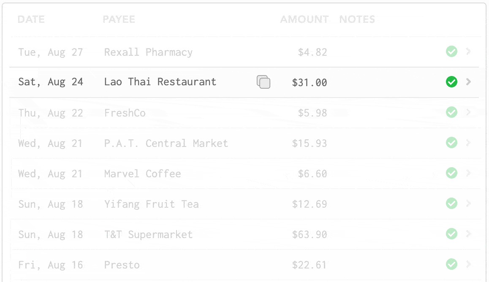

# Transactions

Transactions are the building blocks for your Lunch Money experience! A transaction represents the movement of money, whether that's between existing accounts or from your credit card to a merchant. 

## Creating transactions

For details on automatic bank syncing, check [here](../importing-transactions/automatic-imports.md).

For details on CSV importing, check [here](../importing-transactions/import-via-csv.md).

For details on our Developer API, check [here](../importing-transactions/developer-api.md).

You can manually create transactions by clicking the "Add to Cash" button. "Cash" in this case refers to the default account of your transactions. If a transaction is not linked to any account, it is by default linked to Cash. Alternatively, if you have manually-managed assets set up, you should see options to add transactions to these accounts from the "Add to Cash" dropdown. You can also change the account of any transaction from the transactions details pane.

There are also options to create transactions with specific properties:

1. **Create Transfer** can be used to represent the transfer of money from one manually-managed asset to another. Under the hood, this creates an expense for the originating account and a credit for the destination account, and groups them together so they show up as a net $0. This operation will also update the balance for associated accounts.
2. **Create from Recurring** can be used to automatically create a transaction linked to an existing recurring expense. \(For more details on recurring transactions, check [here](recurring-items.md#recurring-transactions)\)

## How do I handle the case where others pay me back for a large bill that I paid for?

We generally recommend using our grouped transactions feature for this use case. Assuming you footed the bill and your roommates end up paying you back their portion, group together all of these transactions and you should be left with a transaction that represents how much you paid. You can then treat this as a high-level transaction and assign a category to it.

If you don't want to bother recording your friends' payment, you can **split** the transaction and simply categorize the portion paid by your friends to a new category called "Reimbursed" which is excluded from totals and excluded from budgets. This ensures that amount is not counted towards your own expenses.

