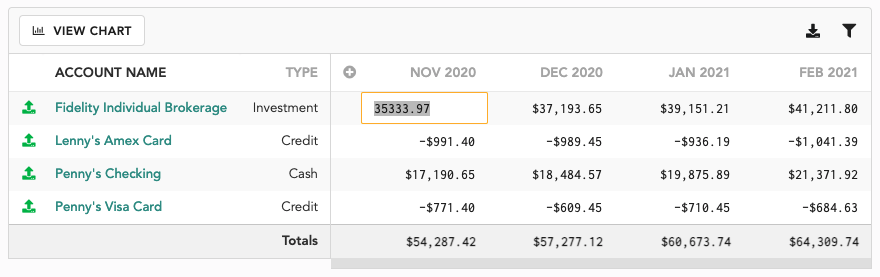
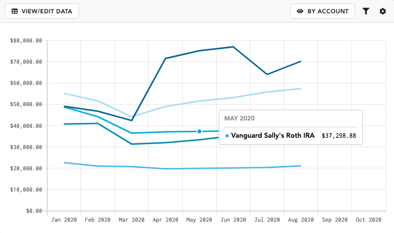
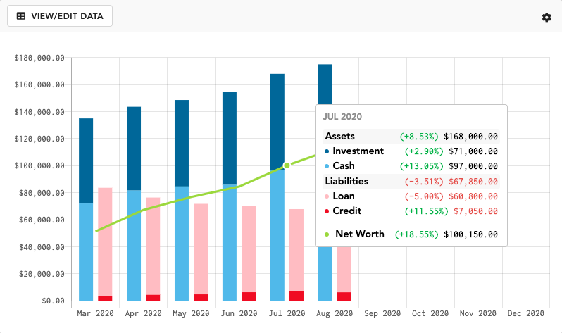

# Net Worth Tracker

## How does it work?

At the end of every month, Lunch Money takes a "snapshot" of all your current account balances (including investment accounts, crypto holdings, credit cards, loans, and more) and records it as the balance for that month. This then becomes a historical account balance and is fully editable by the end user.

The balance shown for the current month is synced with the current account balance, shown also on the [Overview](overview.md#accounts-overview) page's [Accounts Summary](overview.md#accounts-overview) and Accounts page. If the account is a synced account, this balance is not editable by the end user until it becomes a historical account balance.

## Editing historical balances

Sometimes you may want to update your historical account balances. A few reasons you may want to do this are:

* Account syncing was in error mode and a latest balance was not fetched
* You want to backfill historical account balances to get a more complete picture of your net worth over time


The Net Worth Tracker doesn't automatically backfill based on historical transactions. This is because we don't (yet) have a reconcile and starting balance feature that would allow us to easily extrapolate your previous account balances.


To edit historical balances, click on "View/Edit Data" at the top left corner of the chart.

To remove a historical balance, click on a cell, delete all the contents and press Enter.

## View options

### By Account

View your chart data by account. Each line graph represents one account and you can use the filter option (accessible to the right of the "By Account" button) to view only a limited set of accounts for quick and easy comparisons.

### By Type

View your data broken down by asset and liability types.&#x20;

### Show \[percentage change/percentage of total/no percentages]

Choose if you want the percentages shown in the tooltip to denote percentage change from the previous month or the allocation percentage of the class. You can also choose to not show a percentage at all.

### \[Show/Hide] breakdown of accounts

This option is only available when viewing by type. You can choose to hide the individual breakdown of each asset/liability class.

## Frequently asked questions

## 1. Is there a way to backfill my net worth data?

There isn't currently a way to automatically backfill your net worth data since this data is captured once per month at the end of the month.

However, you can manually edit the data yourself. At the top left corner, click on 'View/Edit Data'. You can edit or delete any value prior to the current month.
