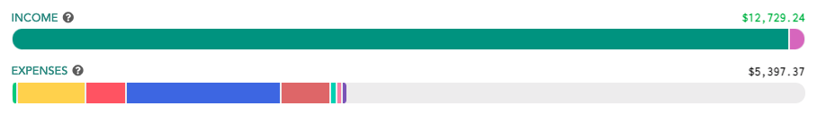

# Overview

## Introduction

The [Overview](https://my.lunchmoney.app/overview) page contains cards designed to give you a quick look into your finances.

## Elements

You'll notice a period picker at the top left corner. The default is set to "Month to date" but you can change the time period to anything from "Year to date" to "Last year" and even a custom start & end date. All the cards on the page will update accordingly _except_ the Accounts Overview card. 

### Accounts Overview

The Accounts Overview card will always give you a **current snapshot** of the accounts and assets you have on Lunch Money. This does not change when you use the period picker. 

If you want to see a trend of your historical net worth, check out [the Net Worth page](net-worth.md).

### Period Summary

The data within the Period Summary card updates with changes to the period picker.

This card breaks down your income and expenses to show you your net income and savings rate. There are also projections included here based on your unpaid recurring items.

If you have income transactions this period, they will add up to **Total Income Earned**. Similarly, any expense transactions will add up to **Total Expenses**.


In Lunch Money, income and expenses are differentiated by the category. If a transaction is in a category marked as "Treat as Income", then it will be considered income regardless of the sign notation. You can set a category to be "Treat as Income" from the Categories page.


If you have set up recurring income and expenses, and there are recurring items that have not yet been paid or received this period, this will show up as **Remaining Recurring Income** and **Remaining Recurring Expenses**. This is essentially earnings or expenses that we are anticipating but have not yet occurred. The total of remaining recurring income/expenses plus total income/expenses make up **Projected Income** and **Projected Expenses**.

**Net Income** is calculated by taking the difference between your Total Income and Total Expenses so far. **Projected Net Income** is calculated by taking the difference between your Projected Income and Projected Expenses.

If you've earned income this period, you'll also see a **Savings Rate** which is calculated using the following simple formula:

$$
\frac{Income - Expense}{Income} * 100%
$$

You'll also see **Projected Savings Rate** if you have remaining recurring items. This is calculated using a similar formula as above, but with Projected Income and Projected Expense instead.

### Spending Breakdown

In the middle, you'll see the Spending Breakdown. This is where you can see a category breakdown of your spending for the time period. There are many customization options to choose from here, and it's all accessible via the cog icon at the top right corner.

#### Show against \[total spend/budget\]

This option affects the horizontal bars for each individual category as well as the far right columns of the table.

Show against total spend will fill the horizontal bars relative to the total spend across all categories. The far right columns will display the total spend/earnings in that category and the percentage that makes up across all spending/earnings.

Show against budget will fill the horizontal bars relative to the budgeted amount for that individual category. The far right columns will display total spend/earnings in that category and how much is left to earn or safe to spend. This is essentially the difference between what you budgeted and what you've spent so far. If you budgeted less than your spending so far, this number will show up in red to indicate that you're over budget!

#### Show bars \[relative to each other/fully expanded\]

This is a view option for the two horizontal bars at the top denoting Income and Expenses. The filled in portion denotes actual transactions broken down in colored parts by category. You can either choose for these two bar fillings to span the entire width of the card \(fully expanded\), or filled accordingly to the same horizontal scale for easier comparison of expense vs icon \(relative to each other\).

#### Display \[only categories with spend/all categories\]

Choose whether or not to display categories that have not had any activity yet this period. At the beginning of any period, you may have very little spending which causes a lot of categories to take up space with $0 spending/earning. This option will help reduce the visual clutter and only show you where you have activity.

#### \[Don't show/Show\] excluded income or expense categories

Every category in Lunch Money has the option of being excluded from totals and excluded from budget.

Depending on which option you've chosen for "Show against \[total spend/budget\]", the Spending Breakdown card will omit categories marked as excluded from totals, or excluded from budget.

#### \[Don't show/Show\] projected spending and earnings

Projected spending and earnings are based on recurring items that have not yet been paid/earned this period. These are spendings and earnings that we are expecting to happen for this period, therefore their totals are accounted for in our projections for the period.

Projected earnings/spending is visually displayed as a diagonally striped, lighter horizontal bar. Recurring items that have been earned/paid are visually displayed as a diagonally striped, dark horizontal bar.

#### \[Don't show/Show\] category groups

Toggle this option to show categories individually, or nested within their category groups.

##  

