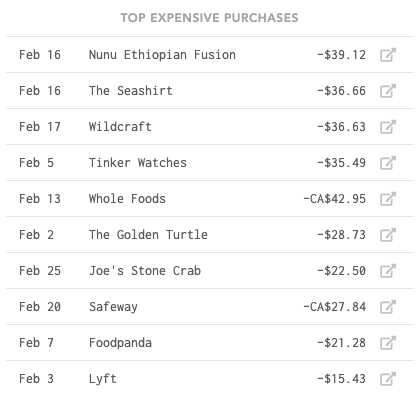
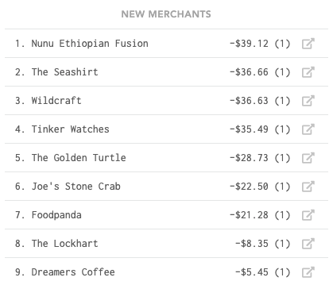
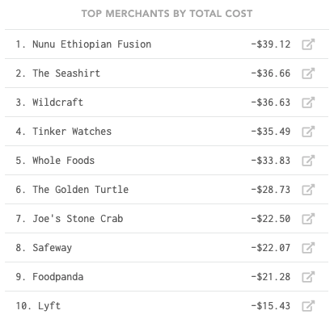
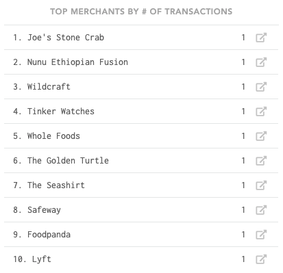
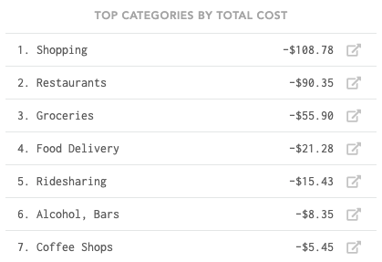
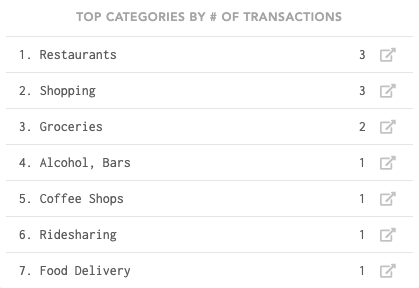
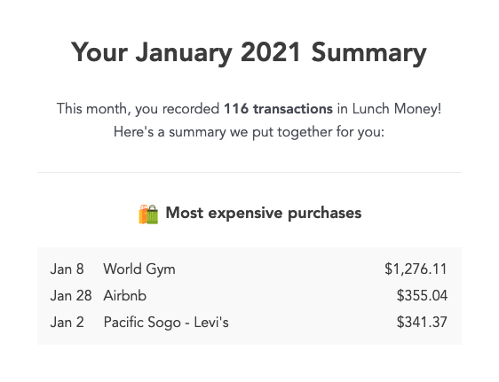

# Stats

## View options

### Period Picker

Use the period picker to choose any time period for your statistics page. 

### Include recurring

Toggle this on to include recurring items in your statistics. You may want to turn off recurring items to get rid of repetitive data. For example, if your rent or mortgage payment is consistently the most expensive transaction, this may clutter your "Top Expensive Purchases" list. Removing recurring items from your data helps you better identify anomalies in your spending.

### Include 'exclude from totals'

Toggle this on to include transactions categorized as 'exclude from totals'. You may want to keep this off to exclude large transactions such as paying off credit card bills from your statistics.

## Elements

### Top Expensive Purchases

This card shows your expenses in descending order by cost.

### New Merchants

This card shows you new merchants seen during this time period. It is also ordered in descending order by cost and shows how many transactions were recorded in parentheses. This is useful to identify new spending habits.

### Top Merchants by Total Cost

This card shows you which merchants you spent the most money with during this period. It doesn't take into account how many times you shopped there, only the total money spent.

### Top Merchants by \# of Transactions

This card shows you which merchants you frequented the most during this period.

### Top Categories by Total Cost

This card shows you the categories where you had the most spending activity measured by total money spent.

### Top Categories by \# of Transactions

This card shows you the categories where you had the highest spending activity measured by number of individual transactions.

## Monthly email digest

Every month, you'll receive a monthly email delivered to your inbox with a summary of the above statistics.

