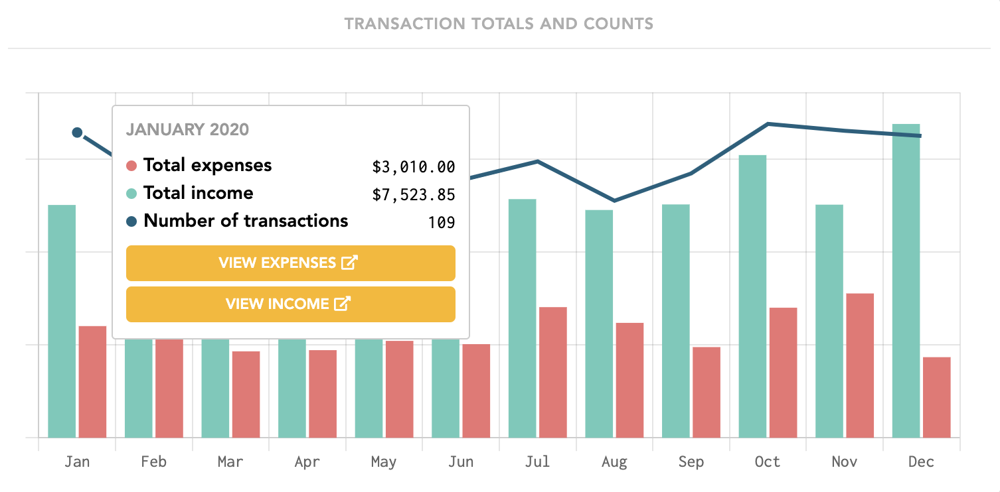
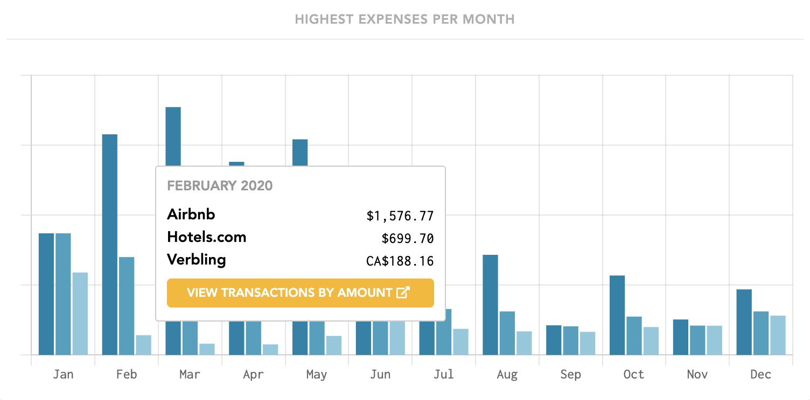
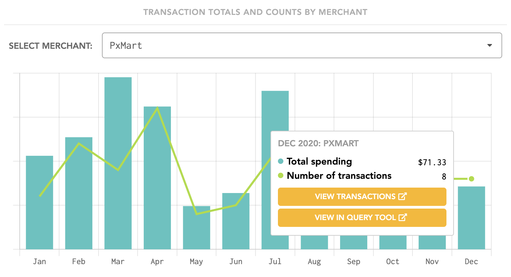
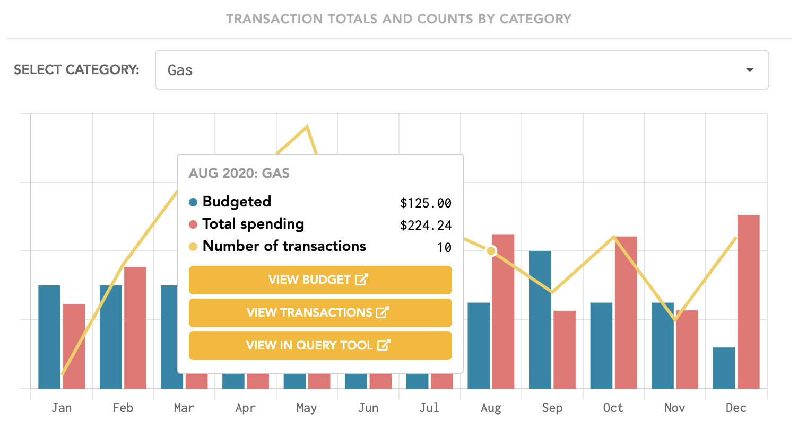

# Trends

## View options

### Period Picker

Use the period picker to choose any time period for your statistics page. We recommend viewing trends over an entire year to get the most interesting insights.

### Include recurring

Toggle this on to include recurring items in your trends. You may want to turn off recurring items to get rid of repetitive data. For example, if your rent or mortgage payment is consistently the most expensive transaction, this may clutter your "Highest Expenses per Month" chart. Removing recurring items from your data helps you better identify anomalies in your spending.

### Include 'exclude from totals'

Toggle this on to include transactions categorized as 'exclude from totals'. You may want to keep this off to exclude large transactions such as paying off credit card bills from your trends.

## Top-level insights

### Total Transactions This Year

This is how many total transaction you've recorded based on the time period chosen.

### Total Expenses Tracked

This is the total cost of expenses tracked as well as number of individual transactions. There is also a link to view these transactions in the Transactions page.

### Total Income Tracked

This is the total earnings in income tracked as well as number of individual transactions. There is also a link to view these transactions in the Transactions page.


In Lunch Money, income and expenses are differentiated by the category. If a transaction is in a category marked as "Treat as Income", then it will be considered income regardless of the sign notation. You can set a category to be "Treat as Income" from the Categories page.


### Savings Rate

Based on your total income and expenses tracked, this is your savings rate for the time period. Savings rate is calculated by:

$$
\frac{(Income - Expenses)}{Income} * 100%
$$

## Charts

### Transaction Totals and Counts

This chart shows the trends in your transactions broken down by income and expenses.

### Highest Expenses per Month

This chart shows the top 3 expensive transactions each month.


Seeing the same transactions every month? Turn them into recurring items and toggle the option above to exclude recurring transactions from your data.


### Transaction Totals and Counts by Merchant

This chart allows you to scroll through your top merchants for this time period and view the trends in spending and frequency over time.

### Transaction Totals and Counts by Category

This chart allows you to scroll through all your categories and view the trends of your spending against your budget \(if applicable\) as well as the frequency of transactions.

