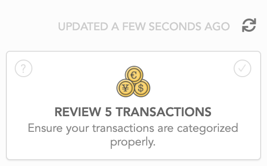

# Automatic Imports

## Introduction

We rely on [Plaid](https://plaid.com), a third-party banking provider, to import transactions and balances for your bank accounts. Plaid is a popular, secure and established service also used by a slew of other personal finance apps on the market. 

Currently, we are only legally allowed to provide this service to US & Canadian based banks. If you are based outside of this region, you may instead take advantage of our [CSV import tool](import-via-csv.md) or [developer API](developer-api.md) to get bulk transactions into Lunch Money.

## Support for international banks

We are slowly rolling out support for UK and EU-based banks. If you're interested in being part of your pilot program, please email us at support@lunchmoney.app 

In the meantime, we have a [developer API ](https://developers.lunchmoney.app)which we're hoping will bridge the gap between Lunch Money & international banks. We already have a few European banks supported via community-made open source plugins such as [bunq](https://github.com/markjongkind/bunq-to-lunchmoney) and [Monzo](https://github.com/joehoyle/monzo-to-lunch-money)!

We also highly recommend using our [CSV import tool](import-via-csv.md) which we have been putting a lot of effort towards making as seamless as possible. Almost 40% of our users are international users so this method has been proven sustainable for long-term use on Lunch Money!

## Fetching the latest data

Balance and transactions are fetched automatically when we receive a notice via webhook from your bank & Plaid \(our third-party banking provider\) that there are new transactions. On rare occasions, this webhook doesn't arrive or somewhere along the line, something hiccups and we don't fetch the latest. In this case, you can manually trigger a fetch from the Transactions page by clicking on the refresh icon:

This operation is also automatically triggered if you go to the Transactions page and we determine that it's been over 12 hours since we last fetch transactions for your accounts.

You can get more information on when we last fetched transactions & balances for your accounts from the [Accounts](https://my.lunchmoney.app/accounts) page.

## Recovering revoked accounts

Connections get revoked if you don't enter your billing information within 5 days of your trial ending.

When a connection gets revoked, that means that we have voluntarily given up our access to your bank data. To continue with bank syncing, you'll need to link a brand new connection to your bank. Your revoked/error'ed connections are not recoverable.

To merge the data from your revoked connections with the new ones, follow these steps:

1. Check each of your revoked/error accounts and note down the date of the last successfully imported transaction.
2. Go through the removal flow for each of your revoked/error accounts and when prompted, elect to keep account data and move to a new manually-managed account.
3. Connect to your bank\(s\). When prompted, set the "earliest import date" to be the last import date as noted in step 1 and enable "Block importing before this date" to prevent duplicates. This will make sure that the newly synced account will only import transactions after this date!
4. Once that's done, click on your newly created manually-managed assets from step 2. For each one, click on "Merge with synced accounts" and choose the associated synced account. This will merge together transactions, recurring items, rules and balance histories.

## FAQ

### I can't connect to my institution!

Do you have an **ad-blocker or other browser extensions** that disable Javascript or otherwise intended to modify behaviour of websites? If so, we've heard reports that these can affect the ability to connect to an institution. We suggest turning these off temporarily when attempting to connect.

Do you have **2FA set up** on your account? If so, institutions requiring a new one-time password on every login are not currently supported due to the nature of the connection.

Do you have multiple **secret questions & answers** set up? If so, it may require you to connect a few more times in order to collect all the answers to all the questions you have set up.

For any other issues, feel free to reach out to support@lunchmoney.app or use the in-app "Submit a bug or feedback" button at the bottom right of every page.

### Why does my account keep requiring me to relink/re-authenticate?

This is most likely related to a multi-factor authentication setting that you have enabled with your bank. In general, Plaid can handle 2FA. However, if a bank requires a unique one-time password on every login or otherwise very frequently, then Plaid will have difficulty maintaining connection. We always suggest checking to see if your bank provides you with app passwords or a setting to enable trusted devices– those would help Plaid maintain the connection!

### Why am I not seeing any transactions for my brokerage/investment accounts?

We're currently not able to get transactions for brokerage/investment accounts. We may be able to get the latest balance if the institution your account is associated with is not deemed an "investment-only bank". If it is, then we suggest creating a manually-managed asset to track the balance yourself.

The reason for this is simply because fetching transactions for brokerage/investment accounts costs  us much more money. At this point, we are choosing to focus mainly on tracking expenses and we are not pursuing to become an investment or portfolio tracking app.

### My institution is not listed.

Unfortunately, we don't have control over which institutions are supported by Plaid. 

According to Plaid, they are not currently prioritizing new institution builds. Their recommendation is to reach out to your financial institution on their behalf and ask them to submit a contact request via [https://plaid.com/plaid-exchange/](https://plaid.com/plaid-exchange/) if they are interested in collaborating directly with Plaid on an API integration.

### What information do you store when I sync my bank account?

If you use the automatic bank syncing feature, we store the following information about your account: 

1. The account name
2. The account mask \(last four digits\)
3. The account type and subtype \(for example, loan and mortgage\)

And then we periodically update any transactions and balance updates.

We do not store, nor do we have access to the account holder's name or other personal information, or account routing numbers.

