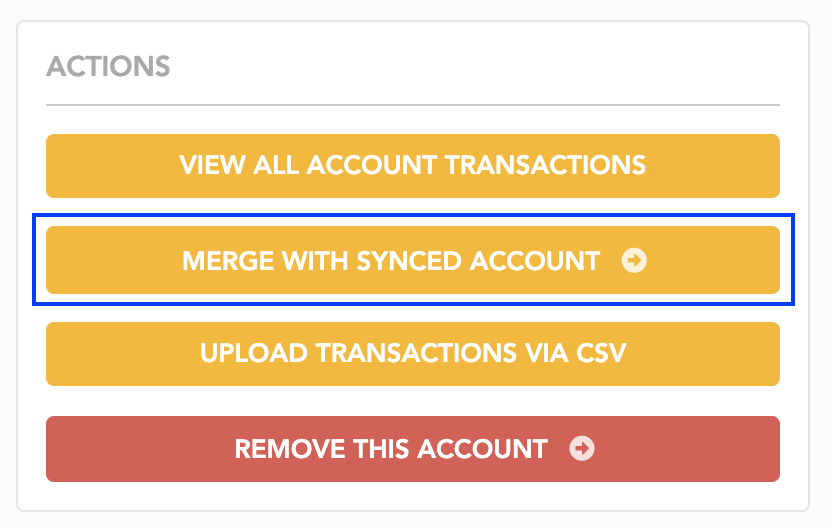

# Automatic Imports

## Introduction

We rely on [Plaid](https://plaid.com), a third-party banking provider, to import transactions and balances for your bank accounts. Plaid is a popular, secure and established service also used by a slew of other personal finance apps on the market. 

If automatic bank syncing is not available in your region, you may instead take advantage of our [CSV import tool](import-via-csv.md) or [developer API](developer-api.md) to get bulk transactions into Lunch Money.

## Frequently Asked Questions

1. [I can't connect to my institution!](automatic-imports.md#i-cant-connect-to-my-institution)
2. [I'm having issues with my bank connection!](automatic-imports.md#im-having-issues-with-my-bank-connection)
3. [Why does my account keep requiring me to relink/re-authenticate?](automatic-imports.md#why-does-my-account-keep-requiring-me-to-relink-re-authenticate)
4. [Why am I not seeing any transactions for my brokerage/investment accounts?](automatic-imports.md#why-am-i-not-seeing-any-transactions-for-my-brokerage-investment-accounts)
5. [My institution is not listed.](automatic-imports.md#my-institution-is-not-listed)
6. [What information do you store when I sync my bank account?](automatic-imports.md#what-information-do-you-store-when-i-sync-my-bank-account)
7. [How do I stop importing transactions for a synced account and only track manually?](automatic-imports.md#how-do-i-track-transactions-manually-for-a-synced-account)
8. [How do I manually insert historic transactions to fill in the gaps for my synced account?](automatic-imports.md#how-do-i-manually-insert-historic-transactions-to-fill-in-the-gaps-for-my-synced-account)
9. [I was tracking my transactions manually, and now I'm using bank syncing. How do I reconcile my transactions?](automatic-imports.md#i-was-tracking-my-transactions-manually-and-now-im-using-bank-syncing-how-do-i-reconcile-my-transactions)

## Support for international banks

Through our partnership with [Plaid](https://plaid.com), we currently support automatic bank syncing for most financial institutions based in the following countries:

* USA
* Canada
* France
* The Netherlands
* Spain
* Ireland
* Germany
* Poland
* Portugal
* Sweden
* Denmark

In the meantime, we have a[ developer API](https://lunchmoney.dev) which we're hoping will bridge the gap between Lunch Money & international banks. We already have a few European banks supported via community-made open source plugins such as [bunq](https://github.com/markjongkind/bunq-to-lunchmoney) and [Monzo](https://github.com/joehoyle/monzo-to-lunch-money)!

We also highly recommend using our [CSV import tool](import-via-csv.md) which we have been putting a lot of effort towards making as seamless as possible. Almost 40% of our users are international users so this method has been proven sustainable for long-term use on Lunch Money!

## Fetching the latest data

Balance and transactions are fetched automatically when we receive a notice via webhook from your bank & Plaid (our third-party banking provider) that there are new transactions. On rare occasions, this webhook doesn't arrive or somewhere along the line, something hiccups and we don't fetch the latest. 

In this case, you can manually trigger a fetch from the [Overview](https://my.lunchmoney.app) page:

<figure><figcaption></figcaption></figure>

and from the [Accounts](https://my.lunchmoney.app/accounts) page:

<figure><figcaption></figcaption></figure>

Both operations will trigger a full fetch of all your synced accounts. This is a background process that usually finishes in under 1 minute.

Note that you can also trigger a refresh from the [Transactions](https://my.lunchmoney.app/transactions) page, but that only fetches transactions for that particular month.

You can get information on when we last fetched transactions & balances for your accounts from the [Accounts](https://my.lunchmoney.app/accounts) page. Hovering over the 'Last updated' timestamp will show two dates:&#x20;

<figure><figcaption></figcaption></figure>

**Last fetch from server** indicates the last time we successfully pinged Plaid for the latest transactions. This may or may not result in new transactions being imported.

**Last transaction update** indicates the last time we successfully imported new transactions from Plaid.

## Recovering revoked accounts

Connections get revoked if you don't enter your billing information within 5 days of your trial ending.

When a connection gets revoked, that means that we have voluntarily given up our access to your bank data. To continue with bank syncing, you'll need to link a brand new connection to your bank. Your revoked/error'ed connections are not recoverable.

To merge the data from your revoked connections with the new ones, follow these steps:

1. Check each of your revoked/error accounts and note down the date of the last successfully imported transaction.
2. Go through the removal flow for each of your revoked/error accounts and when prompted, elect to keep account data and move to a new manually-managed account.
3. Connect to your bank(s). When prompted, set the "earliest import date" to be the last import date as noted in step 1 and enable "Block importing before this date" to prevent duplicates. This will make sure that the newly synced account will only import transactions after this date!
4. Once that's done, click on your newly created manually-managed assets from step 2. For each one, click on "Merge with synced accounts" and choose the associated synced account. This will merge together transactions, recurring items, rules and balance histories.

## FAQ

### I can't connect to my institution!

Do you have an **ad-blocker or other browser extensions** that disable Javascript or otherwise intended to modify behaviour of websites? If so, we've heard reports that these can affect the ability to connect to an institution. We suggest turning these off temporarily when attempting to connect.

Do you have **2FA set up** on your account? If so, institutions requiring a new one-time password on every login are not currently supported due to the nature of the connection.

Do you have multiple **secret questions & answers** set up? If so, it may require you to connect a few more times in order to collect all the answers to all the questions you have set up.

For any other issues, feel free to create a support ticket with us (see below). We're happy to help!

### I'm having issues with my bank connection!

We offer personalized support for all issues related to your bank connection. The easiest way to get help is by creating a support ticket from the Accounts page. Click on the account that you're having issues with, and select "I need help with this account". We'll walk you through creating a support ticket!

<figure><figcaption></figcaption></figure>

### Why does my account keep requiring me to relink/re-authenticate?

There are many reasons for this and all of it depends on your bank! Some common causes are:

* A multi-factor authentication setting that you have enabled with your bank. In general, Plaid can handle 2FA. However, if a bank requires a unique one-time password on every login or otherwise very frequently, then Plaid will have difficulty maintaining connection. We always suggest checking to see if your bank provides you with app passwords or a setting to enable trusted devices– those would help Plaid maintain the connection!
* Some jurisdictions require banks to renew third-party access every 90 or 120 days for security purposes.
* Plaid works directly with your bank and then wrangles the data to send downstream to apps like Lunch Money. This technology (both on your bank and Plaid's side) is far from perfect and hiccups along the way are not unheard of.&#x20;

### Why am I not seeing any transactions for my brokerage/investment accounts?

Automatically importing transactions for some investment accounts is supported but not enabled by default.

If you have automatically synced investment accounts that are supported for this feature, you'll see an option to "Sync transactions (beta)" under "Advanced Settings" in the Accounts page. Note that you'll need to enable this option for each investment account you want transactions for.

### My institution is not listed.

If your institution is not currently supported by Plaid, feel free to submit a support ticket to request it! If Plaid sees enough demand for an institution, they may prioritize it.&#x20;

To submit a request, click on 'Help' at the top left corner and select 'Submit a bug or feedback' and then 'Institution request for syncing':

<figure><figcaption></figcaption></figure>

### What information do you store when I sync my bank account?

If you use the automatic bank syncing feature, we store the following information about your account:&#x20;

1. The account name
2. The account mask (last four digits)
3. The account type and subtype (for example, loan and mortgage)

And then we periodically receive transactions and balance updates.

We do not store, nor do we have access to the account holder's name or other personal information, or account routing numbers.

### How do I stop importing transactions for a synced account and only track manually?

If your transactions were automatically syncing with your bank, and something happened such as a service disruption, you can temporarily track transactions manually for a synced account.

It's important to note that synced accounts inherently do not support manual transactions. So, you'll need to convert the synced account to a manual account. To do this, you'll need to go through the account removal flow and opt to keep all existing data.

Click on the account in question and scroll down in the side pop-up to where it says "Remove  account". Decide if you only want to manual track for this account, or all other associated accounts within the same institution.

Once you've made your selection, make sure you have the following selected to keep all your existing data and to assign it to a new manually-managed asset. If you have an existing one that you want to use, you may also choose that one. We also recommend that you elect to keep your balance history (this is asked in the next screen).

<figure><figcaption></figcaption></figure>

Once you've gone through this flow, you are able to treat this account as a manually-managed account and add transactions to it. The balance will automatically update, and you may also reconcile your balance at any point from the Accounts page.


Note: this option makes it so that you stop attempting to sync this account automatically. If you'd like to continue automatic syncing of transactions, see the next FAQ.


### How can I edit imported transactions or add transactions to my synced account?

By default, we do not allow modifications to transactions for synced accounts. However, you can enable a setting to allow updating this information. This may be helpful if there were gaps in which syncing was broken, or if you find one or two transactions missing and you want to add these yourself.&#x20;

This setting is on a per-account basis. Go to the Accounts page and click on the account for which you would like to allow modifications. Then enable the following setting under 'Advanced Settings':

<figure><figcaption></figcaption></figure>

### How do I manually insert larger amounts of historic transactions to fill in the gaps for my synced account?

Are you automatically syncing new transactions for an account but you're missing historical transactions that you'd like to manually import, either via our CSV tool or developer API?

First, create a new, temporary manually-managed account and import your transactions to this manual account.

Next, click on the manually-managed account within the Accounts page, and locate the "Merge with synced account" option under Actions:

This will merge your temporary manually-managed account and its transactions with the selected synced account. It's important to do this only for historical transactions because our system will not automatically detect or de-duplicate manual transactions with newly imported transactions.&#x20;

### I was tracking my transactions manually, and now I'm using bank syncing. How do I reconcile my transactions?

If you were tracking your transactions manually while your bank was either not supported for syncing or undergoing downtime, you may want to reconcile your transactions with the new bank connection.

The first step is to identify the date of the latest transaction you added for this account. **Do this before you link to your bank**. When prompted, set the "Earliest import date" to the date of the latest transaction and select "Block importing before this date".


#### What if I already linked my new bank?

Never fear! You can set these fields by clicking into your account. This will prevent future transaction updates from importing older transactions. You'll then need to manually remove your duplicates. You can do this easily by identifying duplicate transactions using the filtering feature in the Transactions page.

For example, set a filter to only show transactions from your new synced account and your old manually-managed account. Sort by date and use the bulk-selection method to bulk-delete transactions.


This makes it so that our system will not automatically import transactions before a certain date. Since this date is set to the date of your most recent manual transaction, there should be no duplicates imported.

Once your new bank connection is active, click into your old manually-managed asset and choose the option "Merge with synced account".

Follow the instructions and make sure to merge over all transactions and balance history for a seamless experience!

