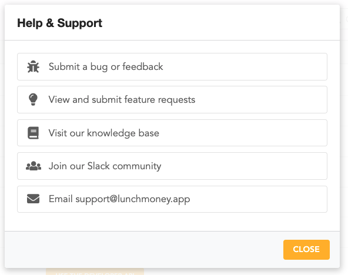

# Customer Support

There are a few ways to get in touch with Lunch Money. Clicking on the "Help" link at the top right corner will bring up relevant shortcuts:

### Submit a bug or feedback

This option will pull up a form for submitting direct feedback to us. You'll need to let us know the type of feedback you're submitting– is it a bug, a feature request, issues with syncing or a general inquiry? Depending on your choice, we'll have some follow-up questions or suggestions of other resources to check out. Finally, you can choose your priority level which should set an expectation of when you'll hear back from us.

### View and submit feature requests

Have a feature request? We highly recommend checking out our [Canny](https://feedback.lunchmoney.app), which is our feature request management tool. From there, you can see if other users have already requested the same feature and you can vote on features to keep posted on any developments. You can also add your own feature requests for other users to vote on.

### Visit our knowledge base

You're here now!

### Join our Slack community

We have a Slack community for paid members of Lunch Money. This is a great place to ask questions about how other users use Lunch Money and to get general support with the product. [Learn about it here](community.md).

### Email support@lunchmoney.app

Need help with something else? We're just an email away!

