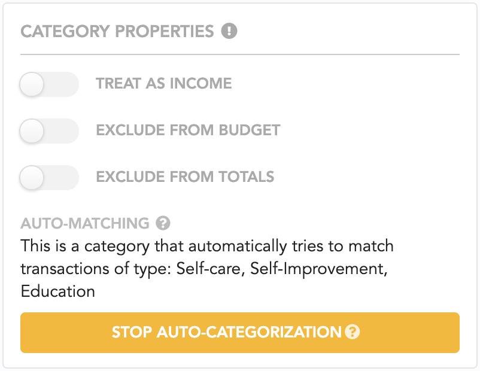

# Categories

Categories are an essential way to organize your transactions in Lunch Money. Every transaction can have at most one category and uncategorized transactions are highly discouraged!

In Lunch Money, categories have three properties which are important to understand as they dictate how transactions in those categories are treated throughout Lunch Money.

## Category Properties

Each category has 3 properties. A sub-category inherits these property settings from their parent category. You can update the properties for any category by going to the Category page and clicking on any of the categories to open the side modal.


Sub-categories inherit these properties from their parent categories!


### Treat as income

Throughout Lunch Money, you will see in overview and summaries a line item called "Income" along with "Expenses". The "Income" line item is calculated strictly from transactions in categories which are marked as "Treat as income". 

This means if you have an uncategorized credit \(+$500\), it will not be counted towards "Income", and will instead be counted towards "Expenses" even though it is denoted as a credit.

Alternatively, if you have a debit \(-$500\) categorized as treat as income, it will be deducted from your "Income" totals.

You can use this feature to break down your different income streams. For instance, you can have categories named: "Interest income", "Part-time job", "Tutoring job", "Passive income', etc.

### Exclude from budget

Categories marked as "exclude from budget" will not be part of the Budget portion of Lunch Money. You won't be presented with an option to set a budget for these categories.

These are great to use for tracking reimbursable items or emergency expenses.

### Exclude from totals

Transactions in categories marked as "exclude from totals" will not be counted towards total calculations throughout the site. 

These are great to use for tracking payments/transfers between accounts or reimbursable items.

In the Analyze feature, there is an option to include these transactions in totals calculations.

## Category groups

You may nest categories within another category, creating a category group. Category groups should include more than 1 category.

To add a category to a category group:

1. Add a new category first \(optional\)
2. Click on your pre-existing category group and go to "Edit category group"
3. From there, you can create a new category to automatically add to the group or add an existing category to the group.

You may not set an existing category to be a category group because transactions may not be assigned to a category group. 

With category groups, you can quickly filter by a group in the Transactions page or Analyze page. In the Overview page, you can also see your spending breakdown by category group.

## Suggested categories

Upon signing up for Lunch Money, we present a few categories to get your started. These are suggested categories that will automatically be assigned to related transactions based on our best guess.

For this reason, it's not a good idea to add and subsequently rename these categories to be something completely unrelated!

As you categorize and re-categorize your transactions, [rules](http://localhost:8080/rules) will be created to override these default matches.

If you want to add some suggested categories, you can do so via the "Add new category" dropdown.

Alternatively, if you want to stop the auto-categorization feature on these suggested categories, you can set this individually in the categories detail pane.

