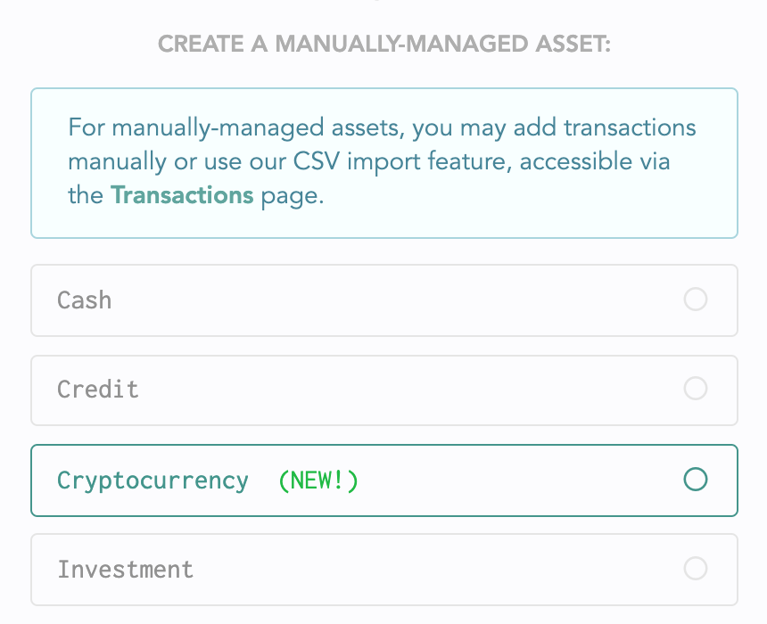

# Crypto

## Tracking crypto manually

Tracking your crypto assets and holdings manually is very easy in Lunch Money. Latest exchange rates are pulled every few minutes so you'll get the latest balances reflected properly as part of your net worth.

### Setting up manual crypto tracking

To set this up, go to the [Accounts](https://my.lunchmoney.app/accounts) page and click on "Add Account". 

Next, scroll to the bottom section labeled "Create a manually-managed asset" and choose Cryptocurrency.

Click 'Next' and select your cryptocurrency from the dropdown.


We support over 300 cryptocurrencies with more being added every week by user demand. So if you don't see your cryptocurrency supported, simply let us know and we'll work on adding it!


Click 'Next' again and fill out basic details on how you would like this crypto asset to be displayed throughout Lunch Money.

Once you're done, click 'Next' again and enter how much of this token you hold. This is the number of tokens you hold and not the fiat balance. We will calculate that for you based on your primary currency automatically.

