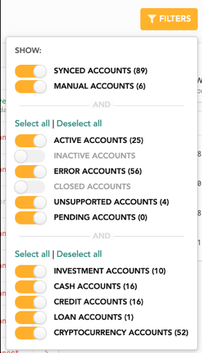
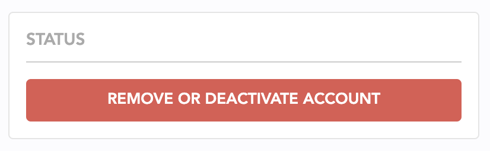
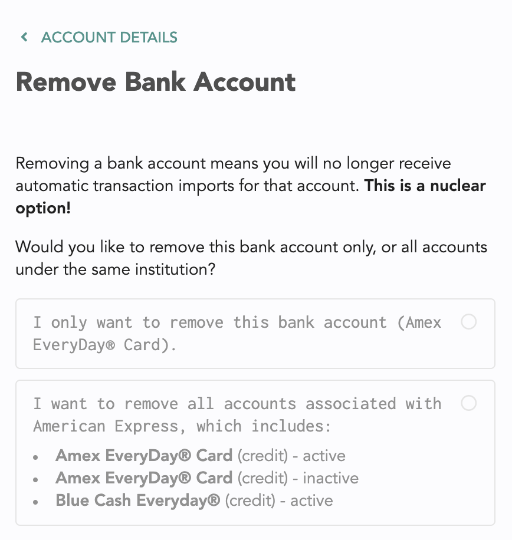

# Accounts

## Frequently Asked Questions

1. [How often should I expect new transactions to get imported?](linked-accounts.md#how-often-should-i-expect-new-transactions-to-get-imported)
2. [I opened a new account with my bank. Will this show up automatically in Lunch Money?](linked-accounts.md#i-opened-a-new-account-with-my-bank-will-this-show-up-automatically-in-lunch-money)
3. [How do I de-activate or remove a synced account?](linked-accounts.md#how-do-i-de-activate-or-remove-a-synced-account)
4. [How do I remove 'inactive' synced accounts?](linked-accounts.md#how-do-i-remove-inactive-synced-accounts)
5. [How are manually-managed account balances updated?](linked-accounts.md#how-are-manually-managed-account-balances-updated)
6. [How do I merge a manually-managed account with a synced account?](linked-accounts.md#how-do-i-merge-accounts)
7. [My partner and I have joint accounts and they are showing up twice with duplicate transactions. How do I handle this?](linked-accounts.md#my-partner-and-i-have-joint-accounts-and-they-are-showing-up-twice-with-duplicate-transactions-how-do-i-handle-this)

## How often should I expect new transactions to get imported?

It's important to note there are 3 parties involved in getting your bank data: Your bank, Plaid \(our third-party banking importer\) and Lunch Money. We interact with Plaid to get the latest from your bank.

Updates between your bank and Plaid can take anywhere between 1 and 3 business days. Once Plaid receives an update, they notify us and we re-sync your account immediately. Other than that, our system also syncs up with Plaid at least once every 2 days to ensure nothing fell through the cracks.

If there are missing transactions or incorrect balances, that's usually an issue between your bank and Plaid. If that's the case, let us know and we can look into it for you :\)

## I opened a new account with my bank. Will this show up automatically in Lunch Money?

Yes, if you have new accounts with your bank and it's set up for automatic syncing, the system will automatically detect this. In some rare cases, this could take a few days to show up. Do not add a new bank connection as this will result in duplicate accounts.

If your account is taking longer than expected to show up, reach out to support and we will reach out to Plaid, our third-party banking importer, for further support.

## How do I de-activate or remove a synced account?

Deactivating or removing a synced account means you no longer want us to fetch the latest transactions and balance for it.

You can click into the account you want to deactivate and click "Remove this account". This gives you the option to remove _only_ that account and the choice to keep or remove associated items \(transactions, balance history, etc\). This will still show up in your list of accounts as 'inactive' but you can use a View filter to remove this from view.

## How do I remove 'inactive' synced accounts?

To answer this question, we first need to provide a bit of context as to how syncing works.

When you connect to your bank, we get an access token which gives us read access to all of your accounts. Every time we fetch new data for you, we'll check each of these accounts for updates. 

When you mark one or two of these accounts as inactive, it means you don't want these balance and transaction updates. So, even though we have access to read that data, we skip them due to your preferences. However, that doesn't invalidate the access token as a whole, and at any point you can re-activate these accounts to track in Lunch Money which is why they still show up, albeit as "inactive".

There isn't a way to "remove" inactive accounts. However, if you want to hide these from your view, I suggest using filters, like so:

## How are manually-managed account balances updated?

Manually-managed account balances are updated automatically when you add, remove or update a transaction assigned to that account.

For instance, if you import transactions via CSV, manually add a new transaction or use the developer API to bulk-insert transactions, the associated account balance will update accordingly.

Admittedly, sometimes we miss a few things and your account balance may not update perfectly. In this case, you can always go to the Accounts page and manually update the balance.

Note: making a manual update to your account balance will not create any new transactions.

## How do I merge a manually-managed account with a synced account?

### Why would I ever need to do this?

It may be that at some point, your bank integration ran into some issues and you had to switch to a manually-managed account to continue getting your transactions into Lunch Money.

Once the bank integration was fixed, you're now left with two accounts representing the same bank account– one which is synced, and one which is manually-managed. At this point, there is no longer a need for the manually-managed account.

At this point, you can use the **Merge Accounts** feature to combine both accounts into one. Note, this is an irreversible process so do ensure you pick the right accounts.

### How do I merge accounts?

To get to the **Merge Accounts** feature, go to the Accounts tab and click on the manually-managed asset you want to merge.  At the bottom, under "Actions", click the button that says "Merge with synced account".

This will take you to the next step. Here, you will choose the synced account to merge with. 


You may only choose from a list of currently active accounts \(that is, healthy connections\) to merge with.


When we merge your accounts, we will migrate your transactions, recurring expenses and rules over to the new synced account. Import configurations will be deleted as they will no longer be needed. 

You'll likely have two sets of balance histories. On our end, we'll do our best to merge them but when there is a month for which both the manually-managed account and the synced account have a balance history, you'll need to let us know which one to choose. To help you decide this, you can head over to the Net Worth tab to see what balance histories we have for each of your accounts.

And that's it! It might take a few seconds to see changes, but your accounts should now be merged.

## My partner and I have joint accounts and they are showing up twice with duplicate transactions. How do I handle this?

Our account removal flow can help with this!

Get started with this button in the details pane of the duplicate account you'd like to remove:

You'll be asked if you want to remove all accounts associated with the bank or just one account.

After that you'll have the option to keep and transfer all existing transactions or remove them all.

